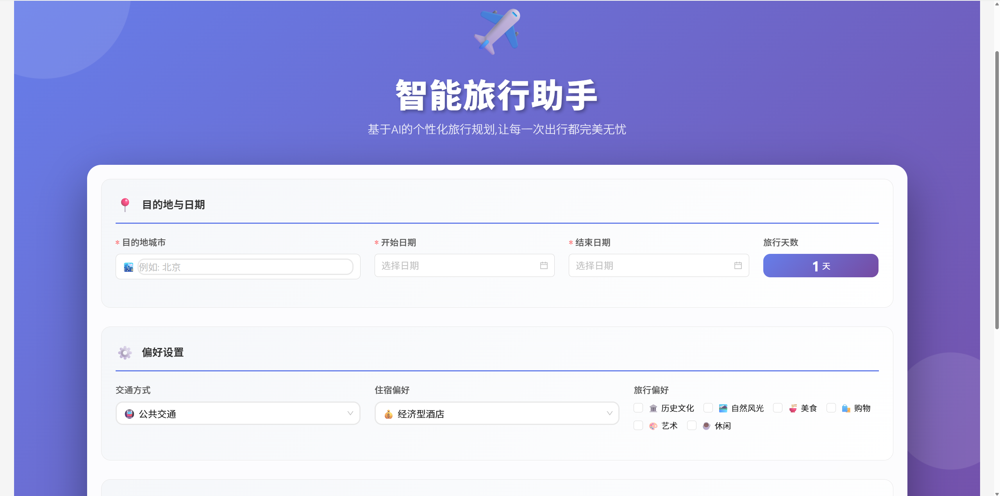
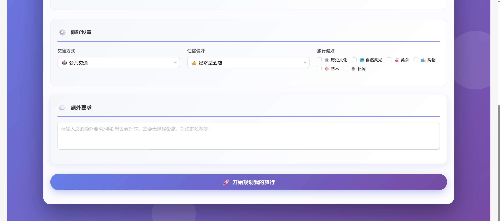
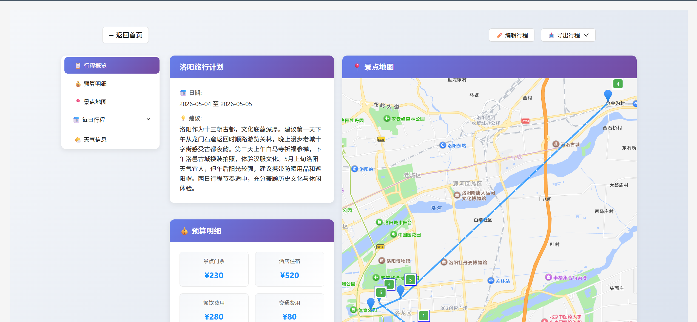
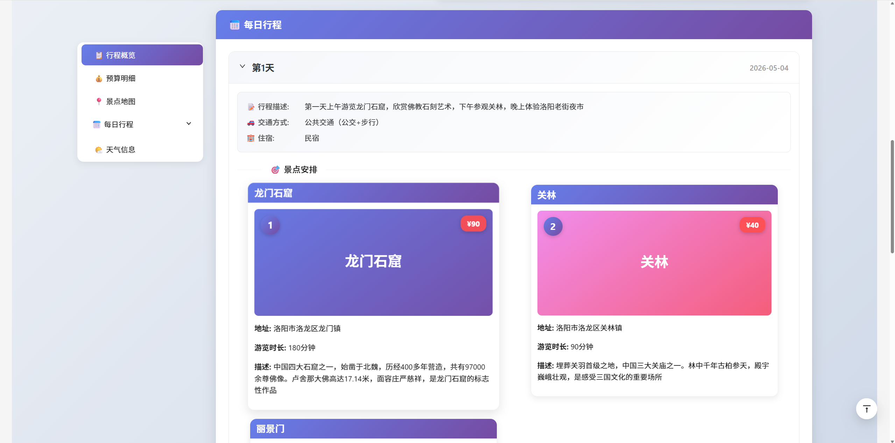
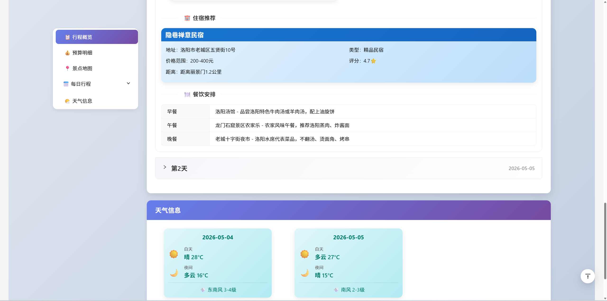
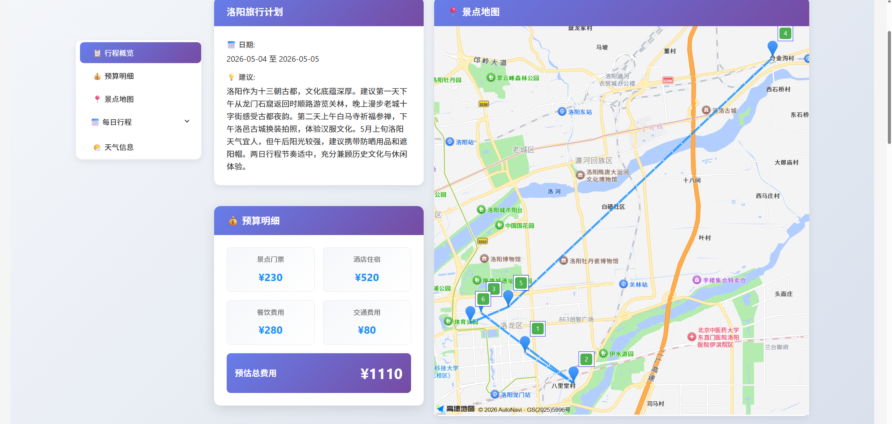

# 智能旅行助手 🌍✈️

> 本项目改编自 [Datawhale](https://github.com/datawhalechina) 开源的 [Hello-Agents](https://github.com/datawhalechina/Hello-Agents) 项目，原项目采用 [CC BY-NC-SA 4.0](https://creativecommons.org/licenses/by-nc-sa/4.0/) 许可证。本项目在原作基础上将后端框架从 HelloAgents 改为 **LangChain**，并对 Agent 实现、API 层和前端进行了适配与优化。

基于LangChain框架构建的智能旅行规划助手,集成高德地图MCP服务,提供个性化的旅行计划生成。

## ✨ 功能特点

- 🤖 **AI驱动的旅行规划**: 基于LangChain框架的OpenAI格式,智能生成详细的多日旅程
- 🗺️ **高德地图集成**: 通过MCP协议接入高德地图服务,支持景点搜索、路线规划、天气查询
- 🧠 **智能工具调用**: Agent自动调用高德地图MCP工具,获取实时POI、路线和天气信息
- 🎨 **现代化前端**: Vue3 + TypeScript + Vite,响应式设计,流畅的用户体验
- 📱 **完整功能**: 包含住宿、交通、餐饮和景点游览时间推荐

##   演示

以洛阳两日游为例:

### 首页 — 填写旅行信息



### 行程概览 — 总览与预算


### 每日行程 — 详细景点安排



### 预算明细 — 费用一览


## 🏗️ 技术栈

### 后端
- **框架**: LangChain、langchain-openai
- **API**: FastAPI
- **MCP工具**: amap-mcp-server (高德地图)
- **LLM**: 支持多种LLM提供商(OpenAI, DeepSeek等)

### 前端
- **框架**: Vue 3 + TypeScript
- **构建工具**: Vite
- **UI组件库**: Ant Design Vue
- **地图服务**: 高德地图 JavaScript API
- **HTTP客户端**: Axios

## 📁 项目结构

```
trip-planner/
├── main.py                     # 入口脚本
├── pyproject.toml              # 项目依赖配置
├── .env                        # 环境变量(API密钥等)
├── src/                        # 后端源码
│   ├── agent/                  # Agent实现
│   │   └── agent.py
│   ├── api/                    # FastAPI应用
│   │   ├── main.py
│   │   ├── config.py
│   │   ├── routes/
│   │   │   ├── trip.py
│   │   │   ├── map.py
│   │   │   └── poi.py
│   │   └── services/
│   │       ├── mcp_agent.py
│   │       └── unsplash_service.py
│   └── models/                 # 数据模型
│       └── schemas.py
├── frontend/                   # 前端应用
│   ├── src/
│   │   ├── views/              # 页面视图
│   │   ├── services/           # API服务
│   │   ├── types/              # TypeScript类型
│   │   └── App.vue
│   ├── vite.config.ts
│   └── package.json
├── img/                        # 演示截图
└── README.md
```

## 🚀 快速开始

### 前提条件

- Python 3.10+
- Node.js 16+
- 高德地图API密钥 (Web服务API和Web端(JS API))
- LLM API密钥 (OpenAI/DeepSeek等)

### 后端安装

1. 安装python依赖
```bash
uv sync
```

2.配置环境变量
```bash
cp .env.example .env
# 编辑.env文件,填入你的API密钥
```

3.启动后端服务
```bash
uv run uvicorn src.api.main:app --host 0.0.0.0 --port 8000 --reload
```

### 前端安装

1. 进入前端目录
```bash
cd frontend
```

2. 安装依赖
```bash
npm install
```

3. 配置环境变量
```bash
# 创建.env文件, 填入高德地图Web API Key 和 Web端JS API Key
cp .env.example .env
```

4. 启动开发服务器
```bash
npm run dev
```

5. 打开浏览器访问 `http://localhost:5173`

## 📝 使用指南

1. 在首页填写旅行信息:
   - 目的地城市
   - 旅行日期和天数
   - 交通方式偏好
   - 住宿偏好
   - 旅行风格标签

2. 点击"生成旅行计划"按钮

3. 系统将:
   - 调用LangChain Agent生成初步计划
   - Agent自动调用高德地图MCP工具搜索景点
   - Agent获取天气信息和路线规划
   - 整合所有信息生成完整行程

4. 查看结果:
   - 每日详细行程
   - 景点信息与地图标记
   - 交通路线规划
   - 天气预报
   - 餐饮推荐

## 🔧 核心实现

### MCP工具调用

Agent可以自动调用以下高德地图MCP工具:
- `maps_text_search`: 搜索景点POI
- `maps_weather`: 查询天气
- `maps_direction_walking_by_address`: 步行路线规划
- `maps_direction_driving_by_address`: 驾车路线规划
- `maps_direction_transit_integrated_by_address`: 公共交通路线规划

## 📄 API文档

启动后端服务后,访问 `http://localhost:8000/docs` 查看完整的API文档。

主要端点:
- `POST /api/trip/plan` - 生成旅行计划
- `GET /api/map/poi` - 搜索POI
- `GET /api/map/weather` - 查询天气
- `POST /api/map/route` - 规划路线

## 🤝 贡献指南

欢迎提交Pull Request或Issue!

## 📜 开源协议

本项目基于 [Datawhale/Hello-Agents](https://github.com/datawhalechina/Hello-Agents) 改编，原项目采用 [CC BY-NC-SA 4.0](https://creativecommons.org/licenses/by-nc-sa/4.0/) 许可证。

本改编作品同样采用 [CC BY-NC-SA 4.0](https://creativecommons.org/licenses/by-nc-sa/4.0/) 许可协议发布。

- **署名 (BY)** — 使用时请注明原作者 [Datawhale](https://github.com/datawhalechina) 及原项目 [Hello-Agents](https://github.com/datawhalechina/Hello-Agents)，并说明本项目所做的修改。
- **非商业性使用 (NC)** — 不得将本项目用于商业目的。
- **相同方式共享 (SA)** — 对本项目的改编或二次创作须以相同许可证发布。

